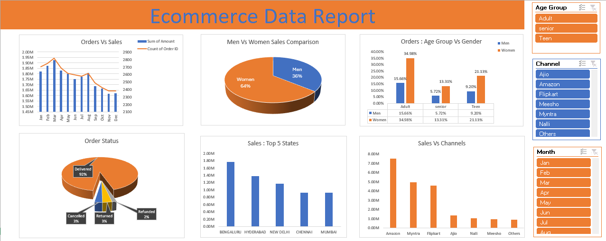

# 📦 E-Commerce Store Data Analysis

## Overview
This project analyzes transactional data from an e-commerce store to understand customer behavior, sales performance, and order patterns. The Excel workbook contains several pivot-based summaries and visual breakdowns of various key performance metrics.

---

## 📊 Sheet Breakdown

### 1. Ecomm Store Data
- **Purpose:** Raw transactional dataset.
- **Contains:** 
  - Customer demographics (Gender, Age, Age Group)
  - Order details (Order ID, Date, Month, Product Category, Size, Quantity, Amount)
  - Shipping info (City, State, Postal Code, Country)
- **Use:** This is the base dataset used to generate all other reports through pivot tables and calculations.

---

### 2. Order Vs Sales
- **Purpose:** Compare monthly order count against total sales.
- **Formulas Used:**
  - **Sum of Amount** and **Count of Order ID** via Pivot Table grouped by **Month**.
- **Insight Gained:** Understand seasonal trends in both revenue and order volume.

---

### 3. Men Vs Women
- **Purpose:** Analyze total sales contribution by gender.
- **Formulas Used:**
  - **Sum of Amount** grouped by **Gender** using a Pivot Table.
- **Insight Gained:** Shows which gender contributes more to revenue.

---

### 4. Order Status Vs Orders
- **Purpose:** Distribution of order statuses.
- **Formulas Used:**
  - **Count of Order ID** by **Order Status** (Cancelled, Delivered, Refunded).
- **Insight Gained:** Helps track fulfillment efficiency and identify refund/cancellation rates.

---

### 5. Sales Top 5
- **Purpose:** Identify top 5 cities by total sales.
- **Formulas Used:**
  - **Sum of Amount** by **City**, sorted in descending order.
- **Insight Gained:** Highlights major contributing regions for targeted marketing or logistics.

---

### 6. Orders Age Vs Gender
- **Purpose:** Cross-analysis of order proportions across Age Group and Gender.
- **Formulas Used:**
  - Percentage of total orders by **Age Group** and **Gender** via Pivot Table with % of column total.
- **Insight Gained:** Identifies target demographic segments.

---

### 7. Sales Vs Channels
- **Purpose:** Sales distribution by selling platform.
- **Formulas Used:**
  - **Sum of Amount** grouped by **Channel** (e.g., Amazon, Myntra, Flipkart).
- **Insight Gained:** Understand which sales channel is most profitable.

---

### 8. Report
- **Purpose:** Likely meant as a dashboard or summary report (currently empty).
- **Note:** Could be intended for visuals or key metrics aggregation from other sheets.

## Report

